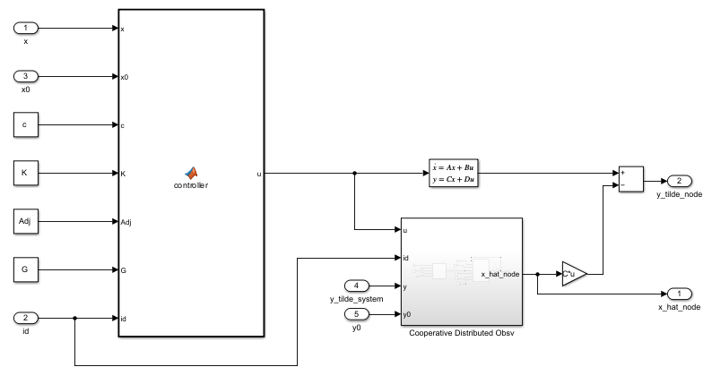
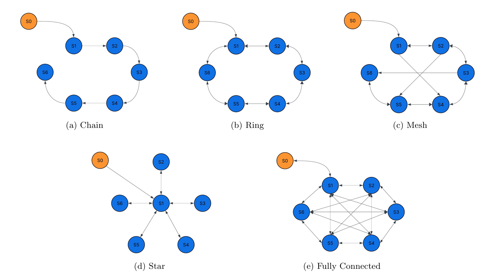
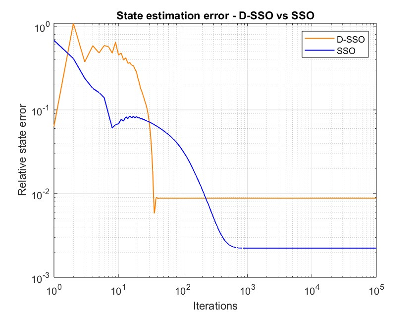
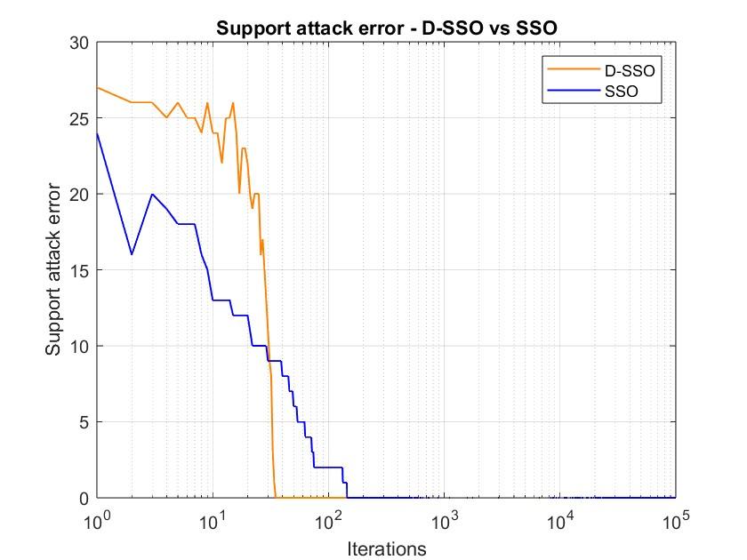

  <h1>Control and Secure Estimation in Cyber-Physical Systems</h1>
  <h3>Distributed Cooperative Tracking & Resilient Dynamic Observers</h3>

This repository contains advanced projects in the modeling, estimation, and control of Cyber-Physical Systems (CPS). The codebase was developed collaboratively with Matteo Guidetti and Marco Coronelli for the *Modeling and Control of Cyberphysical Systems* exam at Politecnico di Torino.

The repository is structured around two main use cases, demonstrating proficiency in optimal control theory, state estimation, distributed systems, and resilience against adversarial attacks. All algorithms and models are implemented in **MATLAB** and **Simulink**.

## 1. Distributed Cooperative Control of a Maglev System Array (`/Maglev_Cooperative_Control`)

This project implements a decentralized cooperative tracking framework for a multi-agent system consisting of 7 magnetic levitation (maglev) units. One unit acts as the **Leader** (trajectory generator), while the remaining 6 act as **Followers**, seeking to drive the global disagreement error to zero.

- **Physics-Based Modeling:** Utilized the linearized state-space equations ($\dot{x} = Ax + Bu$) of a real maglev plant around an equilibrium point.
- **Reference Tracking (Leader):** Engineered the leader node as an autonomous closed-loop system using state-feedback control. Trajectories (Step, Ramp, Sinusoid) are generated by assigning specific closed-loop eigenvalues.
- **Optimal Control Design:** Calculated the control gain ($K$) and observer gain ($F$) by solving the Algebraic Riccati Equation (ARE), demonstrating LQR-like tuning capabilities through the weighting matrices $Q$ and $R$.
- **Distributed State Estimation:** Designed and compared two observer structures to reconstruct unmeasurable states:
    1. **Local Observers:** Each agent estimates its own state independently.
    2. **Cooperative Distributed Neighborhood Observers:** Agents update their estimates using state information exchanged with their neighbors over a communication graph.

    

- **Network Topologies:** Evaluated the performance and robustness of the cooperative control law across multiple graph structures (Chain, Ring, Star, Mesh, Fully Connected), analyzing the required coupling gain ($c$) based on the Laplacian matrix eigenvalues.

    

### Execution
Run `Maglev_sim_1.slx` or `Maglev_sim_2.slx` via Simulink after executing the topology scripts in the `src` folder (e.g. `mesh.m`) to load the workspace variables.

## 2. Resilient Dynamic Estimation under Sparse Sensor Attacks (`/Secure_State_Estimation`)

This project addresses the challenge of estimating the state of a dynamic CPS ($x_{k+1} = Ax_k$) when a subset of its sensors is compromised by an adversary ($y_k = Cx_k + a + \eta$). Because classic Luenberger observers fail when the augmented system loses observability due to attacks, this project implements advanced sparse recovery techniques.

- **Algorithm Implementation:** Developed the Sparse Soft Observer (**SSO**) and the Deadbeat Sparse Soft Observer (**D-SSO**) to achieve online tracking of both the system state and the sparse attack vector.
- **L1-Norm Optimization (P-Lasso):** Leveraged the iterative soft-thresholding operator to enforce sparsity in the attack estimation, isolating the compromised sensors.
- **Target Tracking & Convergence:** Demonstrated that the D-SSO algorithm achieves finite-time convergence, accurately tracking moving targets (Task 4) and rejecting bounded measurement noise and adversarial injections.

  
  

### Execution
Run `main.m` within `Task3_Dynamic_CPS` or `Task4_Target_Tracking` to simulate the observer dynamics and plot the state and attack support estimation errors.

## Technologies and Libraries

- **Languages:** MATLAB
- **Environments:** Simulink
- **Core Theories:** Linear Control Theory, Optimal Control (LQR, ARE), State Estimation (Luenberger, SSO/DSSO), Graph Theory (Laplacian, Adjacency matrices), Convex Optimization (Lasso).